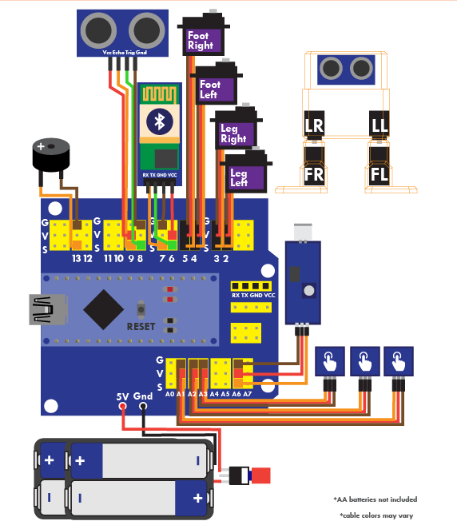

# OttoDIY_mBlock_Extension
Mblock is a software that allows Programming in Scratch Language for robots,Release by MakeBlocks, inherited from Scratch 2.0 by MIT. Extension is a set of files that allows you to install blocks for different types of robots to compatible with mBlock Environment
Download and install mBlock Software: http://www.mblock.cc/

## OttoDIY 
   A BiPedal Robot is very Fun and wonderful opensource project. http://www.ottodiy.com/
   You can build your own and teach your kids programming Scratch for Otto Robot using this Extension 
   

## WHAT NEWS WITH OTTO mBLOCK in SCRATCH languague with this Extension OttoDiy 2.4:
   ### Otto can response sound, can follow the light, can read 2 buttons, can send and receive data to Computer via Serial port   
   ### Added LED MAtrix mouth for emotion 
   ### Added play melody with Buzzer
## Hardware (Basically same OttoDIY++ project)

- connect Servo Hip left to D2
- Connect Servo Foot Left to D4
- Connect Servo Hip right to D3
- COnnect Servo Foot Right to D5
- Buzzer to D13 (Active High)
- HC06Rx to Arduino Tx(D7)
- HO06Tx to Arduino Rx(D6)
- SRF04 Trigger to D8
- SRF04 Echo    To D9
- Max7219   DATA    D10   For LED Matrix emotion
- Max7219   CS    D11     For LED Matrix emotion
- Max7219  CLK    D12     For LED Matrix emotion
- Sound Sensor  to analog A6, 
- Light sensor Left to analog A1
- Light Sensor Right to analog A0
- Button 1    to A2 in pull up input (low active: connect A2 to Gnd) 
- Button 2    to A3 in pull up input(low active: connect A3 to Gnd)
- Refer the My Arduino Library using in Extension for Detail: https://github.com/stembotvn/OttoDIY_Vbot
## Installation Extension in mBlock software
### Quick Installation
- mBlock -> Extensions/Manage Extension/Search, type name: "ottoDIY" by Hien Phan, click download. It will work. 
See Video: https://www.youtube.com/watch?v=lPDUmW9uHto
### Manual Installation
   - Download this repository in Zip file format
   - Open the Mblock software, go to the Extensions / Manage Extensions tab -> Click "Add Extension" -> Browsing to the path of downloaded file
   - Note: Select Zip file (Not Json file), the downloaded Zip file will appear. 
   - Test simple program
## Using
### Connect
- Serial: For Programming Otto in Arduino mode (Scratch Convert to Arduino code) and Scratch Mode (Just Scratch)
- Bluetooth: For Programming Otto in Scratch Mode only
#### Serial
mBlock -> Connect/Serial -> Select Robot connecting COM Port
#### Bluetooth
- Pairing your HC06 with Computer in Bluetooth
- mBlock -> Connect/Bluetooth/Clear Bluetooth -> Discover Bluetooth -> Select right name of HC06 (may be Otto or Zowi...up to you named it)
### Programming
#### Arduino Mode
Scartch Program will be convert to Arduino Code then Upload to Robot as Firmware, the program now run by Robot itself
 - mBlock -> Edit/Arduino Mode: the Arduino Script Area will appear, after programming in Scratch, Select Upload to Arduino to upload the firmware, the mBlock will compile the programming and upload to Robot.
 - mBlock -> Board -> Select Arduino Nano (Mega328)
 - After Upload, the Otto will not able to run in Scratch mode until the compatible firmware is pre-Uploaded
#### Scratch Mode
Scratch Program run in mBlock Software, the command (Scratch blocks) will be sent to Robot to sync the Robot activity.
- The PC need keep on connecting with Robot Otto 
- Otto need to pre-upload by the appropreate firmware depend on using Serial or Bluetooth Connection:
- Library to pre-upload code to Otto for using Scratch mode (must use Arduino IDE to implement): https://github.com/stembotvn/OttoDIY_Vbot
- For Using Scratch Mode in Bluetooth: Pre- Upload example https://github.com/stembotvn/OttoDIY_Vbot/tree/master/examples/Otto_BT_ZowiAPP
- For Using Scratch Mode in Serial (recommend): Pre-Upload example: https://github.com/stembotvn/OttoDIY_Vbot/tree/master/examples/Otto_Mblock_ScratchMode_Serial

The Scratch Mode will fully compatible with Original Scratch 2.0 by MIT, So you can create Desktop Interface, Game, Music, Sound,....Combine with programming Otto Robot, it is really Fun. 
### NOTE: this Scratch mode now just available for Moving block, Gesture block, Sing block, other blocks just run in Arduino mode.

    
